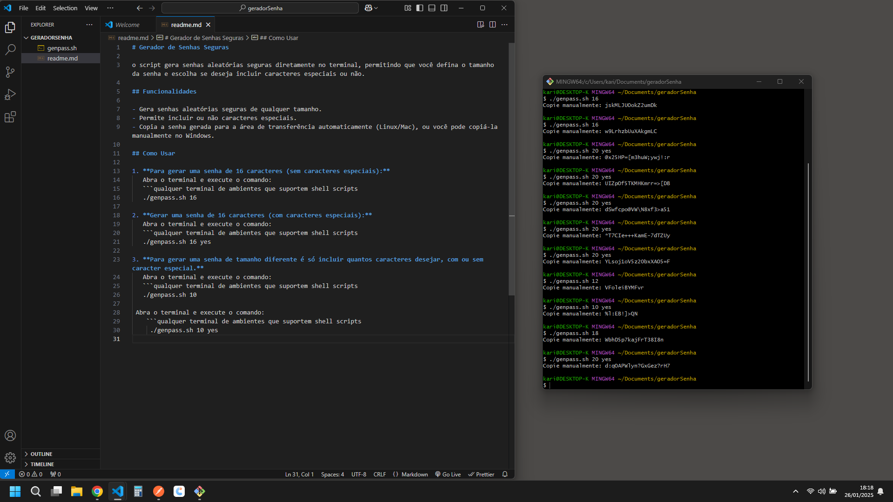

# Gerador de Senhas Seguras

o script gera senhas aleatórias seguras diretamente no terminal, permitindo que você defina o tamanho da senha e escolha se deseja incluir caracteres especiais ou não.

## Funcionalidades

- Gera senhas aleatórias seguras de qualquer tamanho.
- Permite incluir ou não caracteres especiais.
- Copia a senha gerada para a área de transferência automaticamente (Linux/Mac), ou você pode copiá-la manualmente no Windows.

## Como Usar

1. **Para gerar uma senha de 16 caracteres (sem caracteres especiais):**  
   Abra qualquer terminal de ambientes que suportem shell scripts e execute:
   
   ./genpass.sh 16

3. **Gerar uma senha de 16 caracteres (com caracteres especiais):**  
   Abra qualquer terminal de ambientes que suportem shell scripts e execute:
   
   ./genpass.sh 16 yes

4. **Para gerar uma senha de tamanho diferente é só incluir quantos caracteres desejar, com ou sem caracter especial.**  
   Abra qualquer terminal de ambientes que suportem shell scripts e execute:
   
   ./genpass.sh 10
   ou
   ./genpass.sh 10 yes 

# imagem

  

